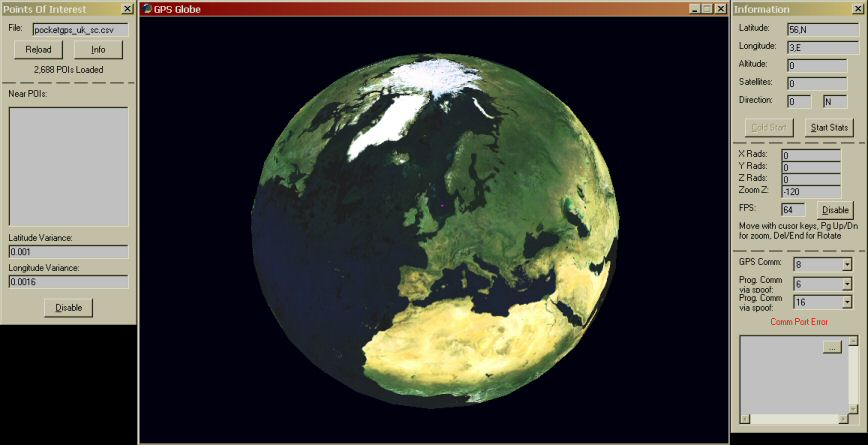



## Earth in 3D, with basic GPS input

### Description

This views the a rotatable earth, if you connect a GPS it will show you the rough position on the globe with a pink square, but when you get on the other side of the planet the accurancy goes down by a dozen miles :( . You can load in a CSV file to inform you if your near a Long/Lat point..... It can record your movents and saves it in another csv file, so you view it on another program attached. I was planning to view the satellites it locks onto and make the earth more detailed when you zoom in on particular points. If I do - I'll upload it another time. This is a bit like a google earth clone.
 
### More Info
 

             |
---                |---
**Submitted On**   |2006-02-11 22:51:38
**By**             |[Matty\_ski](https://github.com/Planet-Source-Code/PSCIndex/blob/master/ByAuthor/matty-ski.md)
**Level**          |Intermediate
**User Rating**    |4.9 (74 globes from 15 users)
**Compatibility**  |VB 6\.0
**Category**       |[Graphics](https://github.com/Planet-Source-Code/PSCIndex/blob/master/ByCategory/graphics__1-46.md)
**World**          |[Visual Basic](https://github.com/Planet-Source-Code/PSCIndex/blob/master/ByWorld/visual-basic.md)
**Archive File**   |[Earth\_in\_3198587482006\.zip](https://github.com/Planet-Source-Code/matty-ski-earth-in-3d-with-basic-gps-input__1-64958/archive/master.zip)

